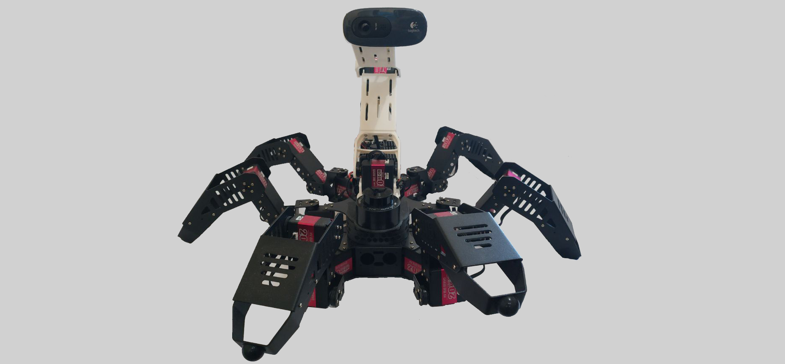

# Sprite
Hexapod robot open project for Raspberry Pi

### Idea

---
Project devoted to build customized home six-legged robot driving by Raspberry Pi platform in pythonic way.
Key purpose is to explore robotic pipelines and design a functional home bot that 
can assist with some daily tasks.
Design assumes integration of a bunch of sensors to control the robot's movements and interactions with its environment.

## Modules under scope
[Taskmap (Miro)](https://miro.com/app/board/uXjVMT52Nm4=/?share_link_id=379331426851)

---
### Hardware
Base frame assembly, component list and protocols description

[Wiring scheme](https://github.com/Nickel-nc/Sprite/tree/main/support_docs/peripheral_wiring)

[Peripheral manuals](https://github.com/Nickel-nc/Sprite/tree/main/support_docs/manuals)

---
### External parts design
Models of extension mounting frames for peripherals and power supply

[Extension printable models](https://drive.google.com/drive/folders/1UUoDLcCy0gEsvXjPSBMBxu4eMZbQfbUY?usp=sharing)

---
### Sensor setup scripts

Communication between RPi and peripherals
- [Bus servo controller](https://github.com/Nickel-nc/Sprite/tree/main/scripts/boardControl)
- [Lidar](https://github.com/Nickel-nc/Sprite/tree/main/scripts/lidar)
- [uSonic](https://github.com/Nickel-nc/Sprite/tree/main/scripts/uSonic)

---
### Kinematics
Pipeline for leg kinematics and walk sequences

[Kinematics page](https://github.com/Nickel-nc/Sprite/tree/main/scripts/kinematics)

---
### SLAM
Convert raw sensor measurements to internal grid map. keep track of position while moving

[SLAM pipeline page](https://github.com/Nickel-nc/Sprite/tree/main/scripts/SLAM)

---
### Path Finding
Pipeline that fuse movement kinematics with localization data using path finding algorithms to perform movement tasks

(WIP)

---
### Limitations

- Assumes using indoor. Localization tested only in close areas
- Key features designed to distribute some complex calculations on local machine
- Current scope is just a sandbox for testing base functional tasks, still in progress

---
