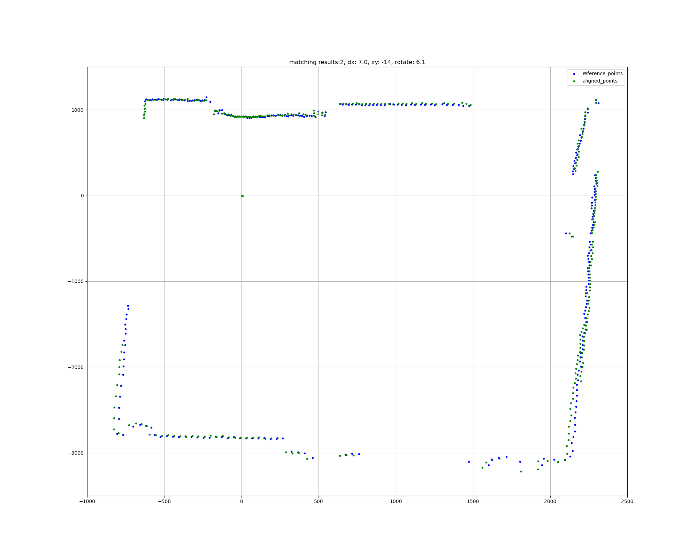
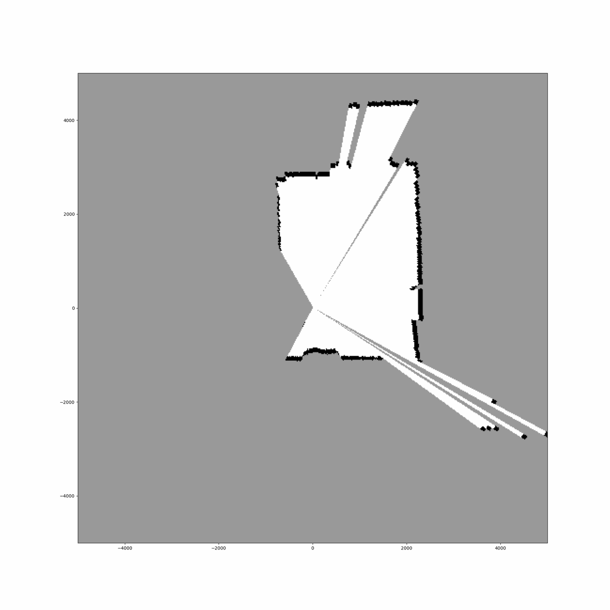

### Simultaneous Localization And Mapping (SLAM)

---

A part where lidar points cloud converted to map. Each scan instance map being updated
with fresh data and through
Probability occupancy grid based
Scan matching uses whole path history (shall test it windowed)

Include the following steps

### Preprocess lidar raw input data

---

<details>
  <summary>Show more</summary>

- Exclude blind zone by cutting lidar input range (current setup: 240 degrees)
- Convert to discret angles with fixed angle step. Due to motor physics lidar returns data with inconstant angles in low threshold. 
(current setup: 1 degree resolution)

data entry format:
  ```
  map: {
    timestamp_i: {
      x: int,
        estimated pos x
      y: int,
        estimated pos y
      theta: float,
        estimated pos theta
      range: list
        [dist_1, dist_2, dist_n],
          where n = input angular range / resolution
    },
    ...
  }
  ```

data entry example


  ```python
  {'1681926877.9563532': {
  'x': 0,
  'y': 0,
  'theta': 0.0,
  'range': [
    396, 413, 1217, 1217, 1202, 1202, 1186, 1170, 1170, 1155, 1155,
    1140, 1140, 1140, 1127, 1127, 1127, 1087, 1005, 973, 990, 974,
    926, 974, 925, 925, 925, 925, 925, 909, 909, 909, 909,
    909, 909, 909, 925, 925, 925, 941, 957, 957, 957, 957,
    973, 973, 1005, 973, 989, 1005, 1005, 1019, 1005, 1005, 1032,
    1032, 1032, 1032, 1100, 1248, 1248, 1248, 1264, 1280, 1295, 1311,
    1341, 1357, 1372, 1388, 1403, 1435, 1450, 1497, 1513, 1528, 1559,
    1605, 1636, 1651, 1682, 1745, 1776, 1791, 4443, 4536, 4676, 4766,
    5265, 5352, 5521, 5668, 4335, 2535, 2458, 2443, 2427, 2380, 2349,
    2349, 2333, 2303, 2288, 2272, 2256, 2241, 2225, 2210, 2210, 2194,
    2178, 2163, 2163, 2303, 2303, 2303, 2288, 2288, 2288, 2288, 2288,
    2288, 2288, 2288, 2288, 2288, 2288, 2303, 2303, 2303, 2148, 2194,
    2334, 2350, 2350, 2349, 2365, 2380, 2396, 2396, 2427, 2427, 2458,
    2474, 2489, 2504, 2535, 2551, 2566, 2598, 2613, 2644, 2675, 2690,
    2753, 2768, 2799, 2815, 2877, 2909, 2940, 2970, 3001, 3078, 3109,
    3141, 3202, 3296, 3342, 3388, 3435, 3574, 3622, 3669, 3745, 3714,
    3668, 3714, 3610, 3513, 3497, 3497, 3559, 4892, 4815, 4784, 4753,
    4707, 4677, 4629, 4614, 4567, 4536, 4521, 4490, 3109, 3172, 4381,
    4412, 4365, 3109, 3047, 3047, 2861, 2861, 2845, 2845, 2845, 2784,
    2845, 2845, 2845, 2845, 2845, 2845, 2845, 2861, 2861, 2861, 2876,
    2876, 2892, 2799, 2799, 2815, 2845, 2721, 2443, 2333, 2225, 2117,
    1978, 1900, 1837, 1760, 1651, 1605, 1558, 1512, 1435]}, 
}
  ```
</details>

### Grid-based processing

---

<details>
  <summary>Show more</summary>

Involves occupancy grid structure for environment representation in 2D space,
created in [occupancy_grid.py](occupancy_grid.py)
On this base further SLAM and path finding pipelined are based


Occupancy grid is probability based and has several grids in total:
- A mesh grid of x and y coordinates to represent each cell in the occupancy grid and keep track where to extend map when robot moves further
- Grid to keep track of which cells have been visited
- Grid of which cells are occupied
- A grid of rays (spokes) emanating from the robot's position to cover the entire field of view of the lidar sensor.
The function calculates the bearing index for each ray based on its angle relative to the robot's orientation.

</details>

### Point clouds matching

---

<details>
  <summary>Show more</summary>

Tested with 2 matchers type:
- icp algorithm for real distance data, that involve iterative least-squares solutions using point. Used as a support reference.
  [icp.py](icp.py)
- scan mather based on the occupancy grid. Involves scan history to correct error propagation due to sensor noise
Implemented in
  [og_scan_matcher.py](og_scan_matcher.py)

|                                                                                                                          |                                                                                                              |
|:------------------------------------------------------------------------------------------------------------------------:|:------------------------------------------------------------------------------------------------------------:|
| frames to be matched  | matched frames  |

</details>


### Keep localize and store history

---

<details>
  <summary>Show more</summary>

[fast_slam.py](fast_slam.py)



</details>


### References

---
<details>
  <summary>Show more</summary>

[PythonRobotics. Nice algorithmic base](https://github.com/AtsushiSakai/PythonRobotics)

[ICP algorithm reference source](https://github.com/richardos/icp)

[SLAM OG reference source](https://github.com/xiaofeng419/SLAM-2D-LIDAR-SCAN)

[Paper: Robot Pose Estimation in Unknown Environments
by Matching 2D Range Scans](http://robotics.caltech.edu/wiki/images/2/27/LuMilios_Paper.pdf)

</details>
