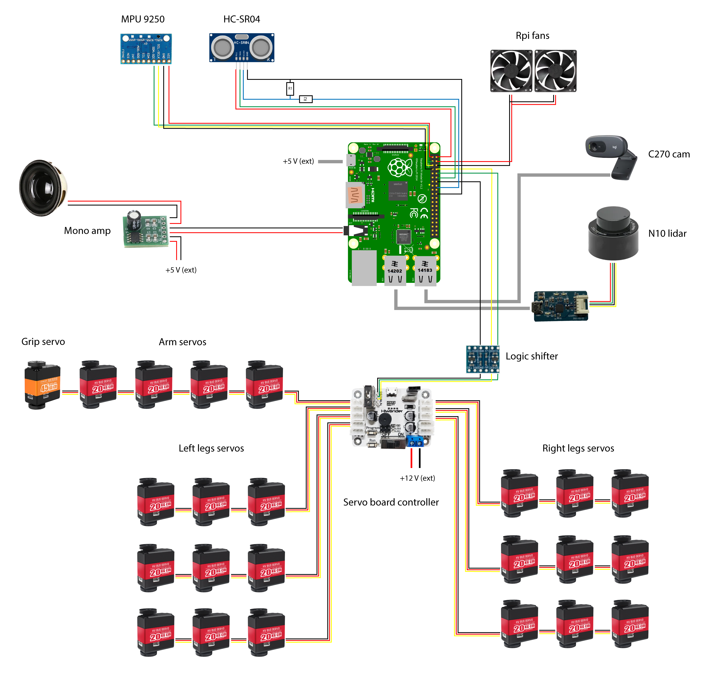

# Peripheral wiring

Current scheme assume peripheral connection to single RPi board. 
Camera and lidar are connected via usb to reduce current draw on gpio pins. 
On further steps some sensors processing can be distributed with additional board like arduino

